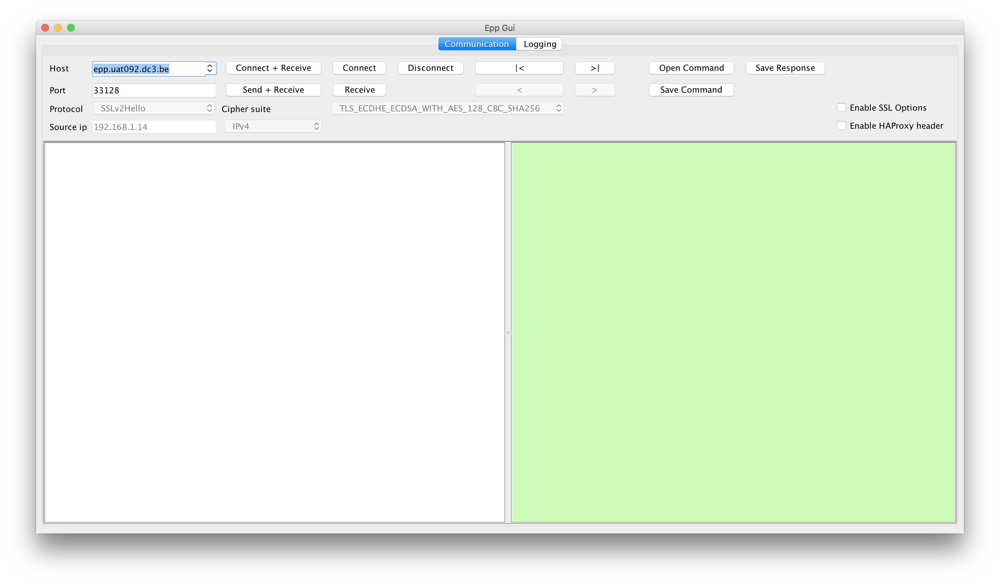

-------------
Communication
-------------

The communication screen consists of several sections:

#. Connection and session controls
#. Command controls
#. SSL Options (default OFF)
#. HAProxy header (default OFF)
#. Input
#. Output

Each section is explained below.

Connection and session controls
^^^^^^^^^^^^^^^^^^^^^^^^^^^^^^^

In the top left section of the communication screen, you control your connection
to the EPP server of your choice.

* Host: Enter the hostname of the EPP server you want to connect with.
* Port: Enter the port of the EPP server you want to connect with.
* Connect + Receive: By clicking this button a hello will be sent to the EPP server.
  If your Host and Port are correct, you should receive a greeting in
  the Output section.
* Connect: By clicking this button a connection will be established and you
  will see "connected" in the Output section.
* Disconnect: By clicking this button the connection to the EPP server will be
  closed.
* Send + Receive: By clicking this button the XML in the Input section will be
  sent to the EPP server, the response will be visible in the Output section.
* Receive: By clicking this button you can read from the socket. This is only
  useful in case the GUI has timed out when sending a command. By clicking
  on Receive it might be possible the response can still be collected.

Command controls
^^^^^^^^^^^^^^^^

In the top center section of the communication screen, you control the commands
you want to send to the EPP server.

* \|<: Go back to the first command you entered in the Input section.
* >|: Go forward to the last command you entered in the Input section.
* <: Go back one command.
* >: Go forward one command.
* Open Command: Open a command from file.
* Save Command: Save a command to file.
* Save Response: Save a response to file.

SSL options
^^^^^^^^^^^

Default off. For internal use.

By enabling SSL options, you can select the specific protocol and cipher
suite. This way, you specify the parameters for your secure connection to the EPP server.

HAProxy header
^^^^^^^^^^^^^^

Default off. For internal use.

Be enabling the HAProxy header, you can set the source IP to connect to the EPP
server, making sure you are connecting from a known whitelisted IP address.

This is used for internal testing and will not work from outside DNS Belgium offices.

Input
^^^^^

In the Input section you can enter the XML command you want to test.
You can simply type the command or select a command from file using the
"Open Command" button.

Output
^^^^^^

In the Output section you will see the response from the EPP server to the
command you entered in the Input section, after clicking "Send + Receive".
The Output section changes colour every time a new response is received. The
colour is independent of the success of the command.
